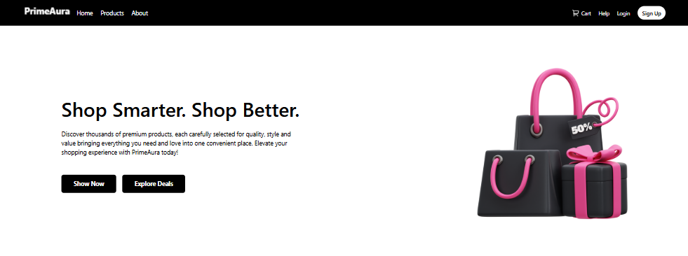
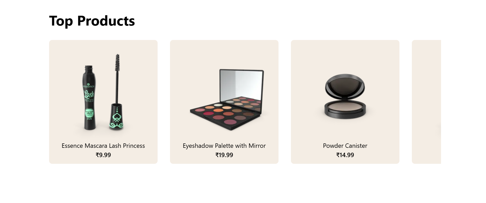
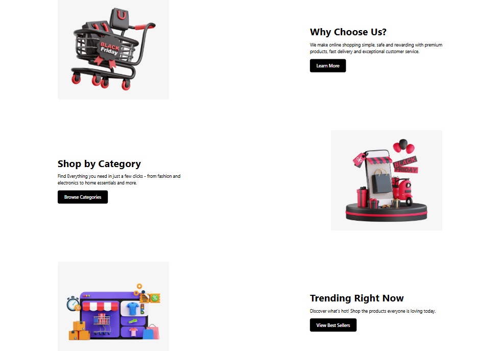
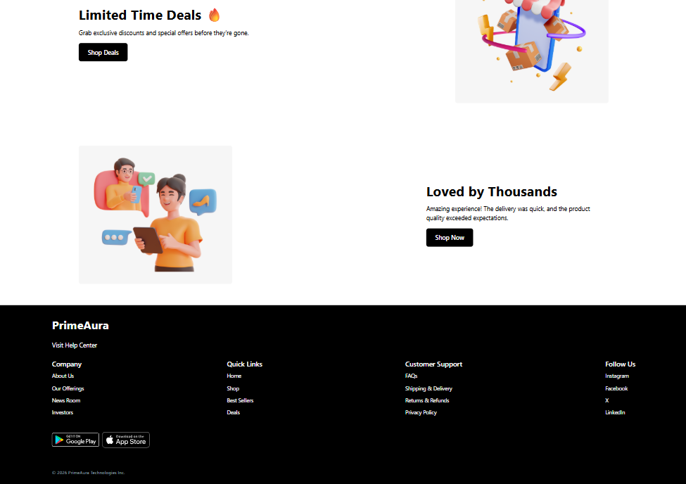

# 🛍️ PrimeAura – E-Commerce Website

PrimeAura is a modern and responsive e-commerce website built with **React.js, Vite, and Tailwind CSS**. It features dynamic products, promotional sections, category highlights, deals, and a clean responsive UI.

## 🌐 Live Demo

Live Website: https://harshit-9818.github.io/PrimeAura/

GitHub Repository: https://github.com/Harshit-9818/PrimeAura

## ✨ Features

- 🏠 Responsive navigation and hero section
- 🛍️ Dynamic product listing
- 🔗 Products fetched from the DummyJSON API
- 🎯 Category and promotional sections
- 🔥 Limited-time deals section
- 📱 Responsive design
- 🎨 Tailwind CSS styling
- 🚀 GitHub Pages deployment

## 🛠️ Tech Stack

- **React.js**
- **Vite**
- **Tailwind CSS**
- **JavaScript / JSX**
- **DummyJSON API**
- **GitHub Pages**

## 📸 Screenshots

### Hero Section


### Top Products


### Features


### Deals & Footer


## 🚀 Run Locally

```bash
git clone https://github.com/Harshit-9818/PrimeAura.git
cd PrimeAura
npm install
npm run dev
```

Build for production:

```bash
npm run build
```

## 📁 Project Structure

```text
PrimeAura/
├── public/
│   └── assets/
├── src/
│   ├── Components/
│   ├── utils/
│   ├── App.jsx
│   ├── App.css
│   ├── index.css
│   └── main.jsx
├── docs/
│   └── screenshots/
├── index.html
├── package.json
├── vite.config.js
└── README.md
```

## 👨‍💻 Author

**Harshit Jain**

[GitHub](https://github.com/Harshit-9818)

## 📄 License

This project is created for educational and portfolio purposes.
